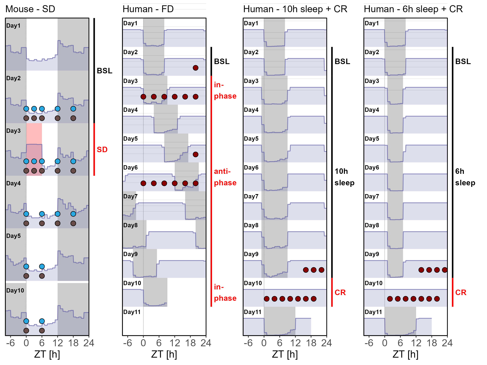

# Analysis_SleepWakeModel

Analysis of gene expression from various datasets

# Data processing

Directory used to quantify and normalize gene expression and sleep-wake amount

## DataProcess_C57BL6J_Cortex

Process of expression in mouse cortex. 

Original publication: https://doi.org/10.1073/pnas.1910590116
Original Dataset: GSE140345 

## DataProcess_C57BL6J_Liver

Process of expression in mouse liver.

New Dataset GSE262410

## DataProcess_Human_Blood

Prcoess of microarray from Forced Desynchrony procotol and Constant Routine protocol.

Forced Desynchrony: GSE48113 https://doi.org/10.1073/pnas.1316335111

Constant Routine: GSE39445 https://doi.org/10.1073/pnas.1217154110

# Data fitting

Fit expression using driven damped harmonic oscillator

## 